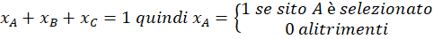
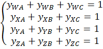
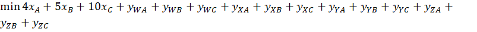

# Analisi dei Percorsi Minimi in una Rete Multinodo
## File Dijkstra.py

## Descrizione

Questo progetto consente di analizzare i costi di percorrenza all'interno di una rete di trasporto composta da più nodi e archi ponderati. Utilizza l'algoritmo di Dijkstra su grafi non orientati per trovare i cammini minimi da diverse sorgenti e determina la configurazione più efficiente in termini di costo.

## Obiettivo

Determinare quale combinazione di nodi sorgente (A, B, C, AB, AC, BC, ABC) garantisce il costo totale minimo considerando:
- il costo fisso associato al nodo o combinazione di nodi
- la somma dei cammini minimi verso tutti gli altri nodi

## Problema







# Principal Component Analysis (PCA)
## File PCA.py

## Tecnologie Utilizzate

- Python 3
- [NetworkX](https://networkx.org/) — per la creazione e l'analisi del grafo
- [Matplotlib](https://matplotlib.org/) — per la visualizzazione del grafo
- [Pandas](https://pandas.pydata.org/) — per la gestione dei dati da file CSV

```bash
git clone https://github.com/tumminia/PLI